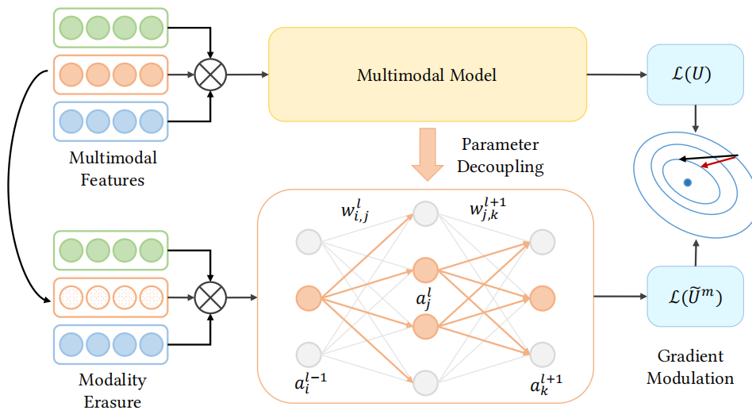
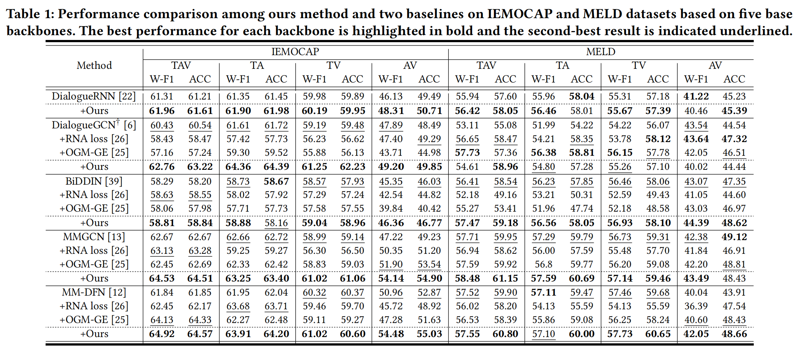

<div align="center">

# Unlocking the Power of Multimodal Learning for Emotion Recognition in Conversation

**Yunxiao Wang**<sup>1</sup> &nbsp; **Meng Liu**<sup>2</sup>✉ &nbsp; **Zhe Li**<sup>1</sup> &nbsp; **Yupeng Hu**<sup>1</sup>✉ &nbsp; **Xin Luo**<sup>1</sup> &nbsp; **Liqiang Nie**<sup>3</sup>

<sup>1</sup>School of Computer Science and Technology, Shandong University  
<sup>2</sup>School of Computer Science and Technology, Shandong Jianzhu University  
<sup>3</sup>Harbin Institute of Technology (Shenzhen)  

✉ Corresponding author  

[](https://doi.org/10.1145/3581783.3613846) [](https://acmmm2023.wixsite.com/fagm)

</div>

## 📌 Introduction

This repository contains the official implementation of the paper **Unlocking the Power of Multimodal Learning for Emotion Recognition in Conversation** (ACM MM 2023). It focuses on the **Emotion Recognition in Conversation (ERC)** task: identifying the emotions underlying each utterance in a conversation by utilizing multimodal information, such as language, vocal tonality, and facial expressions. The proposed Fine-grained Adaptive Gradient Modulation (FAGM) method addresses the issue of *diminishing modal marginal utility*, which occurs due to an imbalanced assignment of gradients across modalities during joint training.

## ✨ Key Features

- 🎯 **Fine-grained Adaptive Gradient Modulation (FAGM)**: A plug-in approach to rebalance the gradients of modalities in proportion to their dominance, enhancing the optimization of suppressed modalities.
- 🔗 **Modal Parameters Decoupling (MDP)**: A novel technique to identify and decouple parameters endemic to specific modalities within complex multimodal frameworks by assessing the sensitivity of each neuron.
- 🚀 **Plug-and-play Compatibility**: Seamlessly integrates into existing multimodal models (early-fusion, middle-fusion, and late-fusion) without requiring substantial architectural modifications.

## 🏗️ Architecture



The method consists of the following key components to resolve imbalanced multimodal learning:
1. **Modal Parameters Decoupling (MDP)**: Evaluates neuron sensitivity across different modalities and decouples the parameters accordingly to identify the modality-specific parameters.
2. **Fine-grained Adaptive Gradient Modulation (FAGM)**: Dynamically monitors the optimization speed of each modality during training and modulates their gradients at the parameter level to ensure balanced learning and prevent modality suppression.

## 📦 Install

### 1. Clone the repository

```bash
git clone https://github.com/iLearn-Lab/MM23-FAGM.git
cd MM23-FAGM
```

### 2. Setup Python Environment

```bash
conda create -n fagm python=3.9
conda activate fagm
pip install torch numpy pandas easydict pyyaml transformers nltk
```

## 📂 Data Preparation

The experiments in the paper use the following two benchmark datasets for Emotion Recognition in Conversation:
- **IEMOCAP**
- **MELD**

Please ensure the pre-extracted features are structured in each model's directory as follows:

```text
model_directory/
└── data/
    ├── IEMOCAP_features/
    │   └── IEMOCAP_features.pkl
    └── MELD_features/
        └── MELD_features.pkl
```

## 🚀 Quick Start

Each baseline model has its own directory containing the execution scripts. For example, to train and test the BiDDIN model:

### Training on IEMOCAP

```bash
cd BiDDIN
bash train_ie.sh
```

### Training on MELD

```bash
cd BiDDIN
bash train_me.sh
```

*(You can apply the same steps for `DialogueGCN`, `DialogueRNN`, `MM-DFN`, and `MMGCN` baseline models by navigating to their respective directories.)*

## 📁 Project Structure

```text
.
├── BiDDIN/                # BiDDIN baseline model implementation with FAGM
├── DialogueGCN/           # DialogueGCN baseline model implementation with FAGM
├── DialogueRNN/           # DialogueRNN baseline model implementation with FAGM
├── MM-DFN/                # MM-DFN baseline model implementation with FAGM
├── MMGCN/                 # MMGCN baseline model implementation with FAGM
├── hyperparameters.xlsx   # Hyperparameters configurations used in the experiments
```

## 📈 Results



## ✒️ Citation

If you find our work useful in your research, please consider citing:

```bibtex
@inproceedings{wang2023unlocking,
  author = {Wang, Yunxiao and Liu, Meng and Li, Zhe and Hu, Yupeng and Luo, Xin and Nie, Liqiang},
  title = {Unlocking the Power of Multimodal Learning for Emotion Recognition in Conversation},
  year = {2023},
  booktitle = {Proceedings of the 31st ACM International Conference on Multimedia},
  pages = {5947--5955},
  doi = {10.1145/3581783.3613846}
}
```

## 🙏 Acknowledgement

- Thanks to the authors and maintainers of the IEMOCAP and MELD datasets.
- Thanks to the open-source community for providing the underlying tools and baseline models related to multimodal Emotion Recognition in Conversation.

## 📄 License

This project is released under the Apache License 2.0.